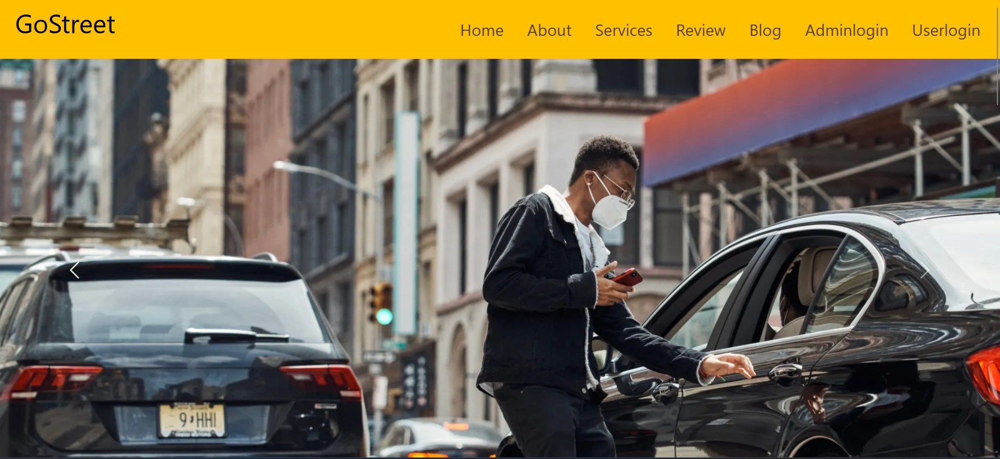

# GoStreet
Github:https://github.com/Abhijeetkokat007/gostreet

Live Demo: https://gostreet.vercel.app/

 ### Description :
GoStreen is an innovative online platform that operates in a similar fashion to Uber, but with a specific focus on environmentally conscious transportation solutions. This website offers a range of services and features designed to provide convenient and eco-friendly transportation options to its users. Here's a detailed description of GoStreen:

**1. Eco-Friendly Transportation**: GoStreen prioritizes environmental sustainability by offering a fleet of vehicles that are either electric, hybrid, or run on clean, renewable energy sources. This commitment to green transportation helps reduce carbon emissions and lowers the environmental impact of travel.

**2. Ride-Sharing:** Users can request rides through the GoStreen website or mobile app, connecting them with nearby drivers who own eco-friendly vehicles. This ride-sharing feature is similar to Uber's ride-hailing service, making it convenient for users to access transportation services.

**3. Driver Network:** GoStreen attracts a community of responsible and eco-conscious drivers who are committed to reducing their carbon footprint. Drivers undergo thorough screening and training to ensure a safe and reliable experience for passengers.

**4. Mobile App:** The GoStreen mobile app is user-friendly and offers features such as real-time tracking, estimated arrival times, and secure payment options. It allows users to request rides, rate drivers, and manage their transportation needs conveniently from their smartphones.

**5. Price Transparency:** GoStreen provides upfront pricing, so users know the cost of their ride before confirming the booking. This transparency ensures that users are not surprised by hidden fees or charges.

**6. Safety Measures:** Just like other ride-sharing platforms, GoStreen prioritizes safety. The app includes features like driver ratings, GPS tracking, and emergency assistance options to ensure passengers feel secure during their rides.

**7. Environmentally Conscious Brand:** GoStreen promotes its eco-friendly brand and mission to reduce the carbon footprint associated with transportation. Users can feel good about their choice to use a sustainable transportation option.

**8. Accessibility:** GoStreen is available in various cities and regions, making eco-friendly transportation accessible to a wide range of users.

**9. Payment Options:** Users can pay for their rides through the app using various payment methods, including credit cards, mobile wallets, and other digital payment options, providing flexibility and convenience.

**10. Commitment to Sustainability:** GoStreen is dedicated to sustainability and regularly updates its fleet to include the latest eco-friendly vehicles and technologies, contributing to a cleaner and greener environment.

### Real Time Use :

GoStreen can be used in various ways to meet your transportation needs while contributing to environmental.

<ul>

<li>  sustainability </li>
<li> Daily Commuting  </li>
<li> Airport Transportation  </li>
<li> Errands and Shopping  </li>
<li>  Special Occasions </li>
<li>  Carpooling </li>
<li>  Business Travel </li>
<li> Late-Night Transportation  </li>
<li> Tourist Exploration  </li>
<li> Ride-Sharing for Events  </li>
<li>  Reducing Personal Carbon Footprint </li>
<li> Supporting Green Initiatives  </li>
</ul>

# Contributors

Made with [contrib.rocks](https://contrib.rocks).

